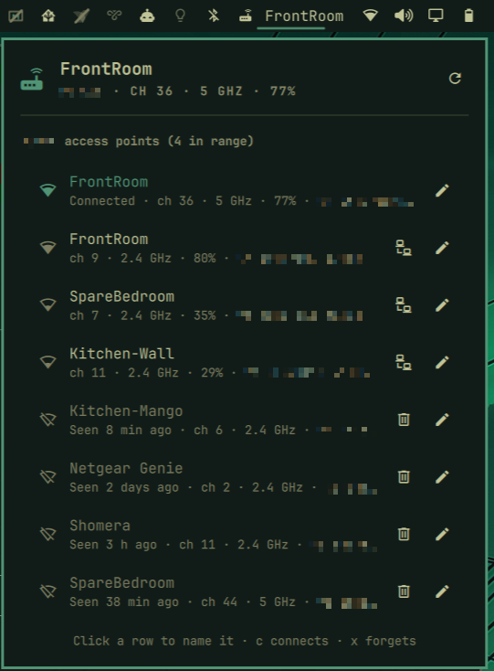

# Access Point (`niall.wotconn`)



Omarchy bar widget that shows which access point of a Wi-Fi network you're
connected to, and lists every access point broadcasting it so each can be
given a name and switched to.

## Why

I have five wireless access points across my house and home office. They all
broadcast the same SSID, and my phone or laptop connects to whichever has the
best signal (mostly). I wanted to see which access point I'm connected to,
and to switch to another quickly and easily.

## Vibe Coding

This (of course) is completely vibe coded. No hand chiselling here. Built with Claude Opus 5.5

## What it does

It follows whichever network you're connected to, but only appears on
networks served by more than one physical access point, like a home with
mesh nodes or an office. Elsewhere it stays hidden. A network counts once
two BSSIDs have been seen in the same band, so a dual-band router alone
doesn't (a tri-band router broadcasting one name on both 5 GHz radios does).

- **Bar:** router icon plus the connected access point's name (or the last
  three octets of its BSSID if it has no name yet). The icon dims while
  Wi-Fi is disconnected.
- **Left-click:** panel with the connected access point and every in-range
  access point for the SSID, strongest first, then every one it has ever
  detected that's out of range now, with when it was last seen. Opening it
  runs a fresh scan (takes about 5 seconds).
- **Right-click:** rescan.
- **Naming:** click a row (or move to it with j/k or the arrow keys and press
  Enter or `e`), type a name, press Enter. Esc cancels; saving an empty name
  removes it. `r` rescans.
- **Connecting:** the connect button (or `c`) on an in-range row switches to
  that access point. Wi-Fi drops for a few seconds while it reconnects. You
  stay on it until the next reconnect (resume, walking out of range), after
  which NetworkManager picks freely again.
- **Forgetting:** the bin button (or `x`) on an out-of-range row removes it
  from the list, name included. In-range rows can't be forgotten because the
  next scan would bring them back; `x` clears an in-range row's name instead.

Dual-band access points show up as two BSSIDs; name both.

## Requirements

- Omarchy with the Quickshell-based shell and plugin support (Omarchy 4).
- NetworkManager managing Wi-Fi, with `nmcli`.
- `bash`, `awk` and `sed`.
- To switch access points, permission to control the network and modify
  system connections, which a local desktop user has by default. Check with
  `nmcli general permissions`.
- Node.js, only to run the tests.

## Install

```sh
omarchy plugin add https://github.com/nialloc/omarchy-access-point --enable
```

`--enable` asks which bar section to put it in. To move it later, e.g. next
to the network widget:

```sh
omarchy bar move niall.wotconn --before omarchy.network
```

## Remove

```sh
omarchy plugin remove niall.wotconn
```

This leaves your names and access point history in
`~/.config/omarchy/wotconn/`. To delete those too:

```sh
rm -rf ~/.config/omarchy/wotconn
```

## What it changes on your system

- It writes only to `~/.config/omarchy/wotconn/`: `labels.json` (your names)
  and `seen.json` (history).
- It reads Wi-Fi scan results through `nmcli`. Opening the panel or
  rescanning asks NetworkManager for a fresh scan.
- Only when you use the connect button (or `c`, or the `connect` IPC call)
  does it touch NetworkManager settings. NetworkManager only associates with
  a particular access point when the profile names its BSSID, so
  `bin/wotconn-connect` pins the profile to that BSSID in memory only
  (`--temporary`), activates it, then puts the saved profile back exactly as
  it was. If putting it back fails, the panel says so and gives the command
  to undo it. A pin left in memory also clears when NetworkManager restarts.

## Data

Names are stored per BSSID in `~/.config/omarchy/wotconn/labels.json`:

```json
{
  "labels": {
    "02:00:00:00:00:01": "Office"
  }
}
```

Every access point detected on a multi-access-point network is remembered in
`seen.json` next to it, with its network, channel, band and when it was last
seen. The file is rewritten at most every 10 minutes per access point unless
something changes. Single-access-point networks are never recorded. Both
files stay on your machine.

## Settings (`~/.config/omarchy/shell.json`)

```json
{ "id": "niall.wotconn", "ssid": "", "showLabel": true, "refreshIntervalSec": 5 }
```

`ssid` empty (the default) follows the connected network. Set it to pin the
widget to one network: it then shows even when you're elsewhere (dimmed),
and records that network whatever its size.

## IPC

```sh
omarchy-shell niall.wotconn current                 # "<name>\t<bssid>", empty when off the network
omarchy-shell niall.wotconn list                    # bssid, name, signal (-1 = out of range), connected
omarchy-shell niall.wotconn label <bssid> "<name>"  # empty name removes it
omarchy-shell niall.wotconn connect <bssid>         # switch to that access point
omarchy-shell niall.wotconn forget <bssid>          # out-of-range ones only
omarchy-shell niall.wotconn rescan
omarchy-shell niall.wotconn toggle
```

## Development

Install it as above: `omarchy plugin add` leaves a git checkout in
`~/.config/omarchy/plugins/niall.wotconn`, so you can work on it in place.
Saved changes there reload automatically. If you keep a checkout elsewhere
and symlink it into `~/.config/omarchy/plugins/`, the shell's file watcher
doesn't follow the link, so run `omarchy restart shell` after editing.

```sh
node tests/model.test.js        # model tests
shellcheck bin/wotconn-connect  # connect helper
```

## License

MIT, see [LICENSE](LICENSE).
